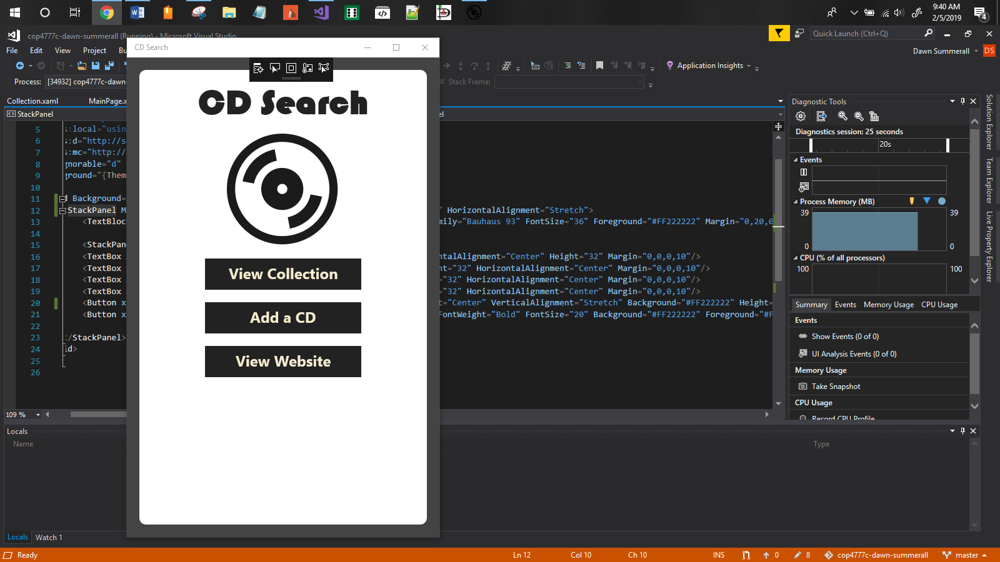
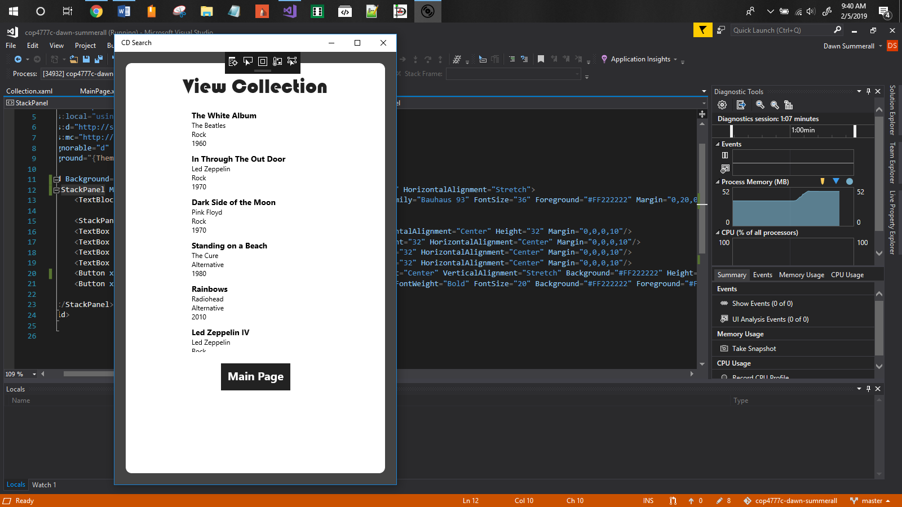
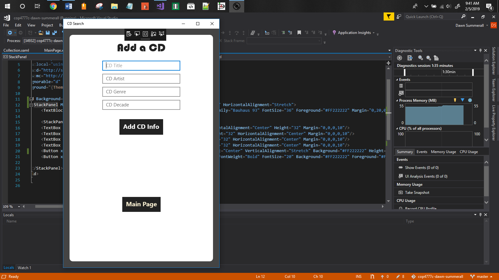
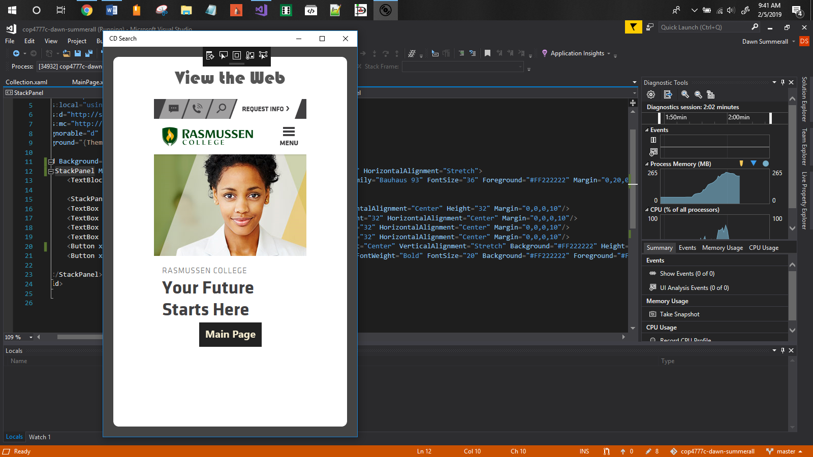

# cop4777c-dawn-summerall

# About This Project

This project is a simple inventory program I created for class at Rasmussen. The user can add a CD to a database collection, view a collection of all the CDs in the collection and view the school webpage. I had hoped to add additional functionality to this application like sorting and listing CDs by artist but, I have not got there yet and class is over. This was a learning exercise to familiarize myself with UWP controls and connecting applications to an Azure database.

# Screenshots

